```{r setup, include=FALSE}
options(htmltools.dir.version = FALSE)
knitr::opts_chunk$set(
  echo = FALSE,
  warning = FALSE,
  message = FALSE,
  fig.retina = 3
)
library(knitr)
```

<style>
.title-slide {
  background-image: url('img/fondo.jpg');
  background-size: cover;
  background-position: center;
}
.remark-slide-content {
  font-size: 24px;
  line-height: 1.4;
  <!-- font-family: "Inter", "Helvetica Neue", Arial, sans-serif; -->
}
.large { font-size: 130% }
.medium { font-size: 110% }
.small { font-size: 80% }
.tiny { font-size: 70% }
.green { color: #2E8B57; }
.blue { color: #4169E1; }
.red { color: #DC143C; }
.yellow { color: #FFD700; }
.highlight { background-color: #ffff99; padding: 2px 4px; }
.box {
  background-color: #f0f8ff; border: 2px solid #4169E1; border-radius: 10px; padding: 20px; margin: 10px 0;
}
.box-small-margin {
  background-color: #f0f8ff; border: 2px solid #4169E1; border-radius: 10px; padding: 20px; margin: 2px 0;
}
.centered { text-align: center; }
blockquote { border-left: 4px solid #4169E1; padding-left: 12px; color: #333; }

.compact .remark-slide-content{
  /* menos relleno arriba/abajo de la slide */
  padding-top: 6px;
  padding-bottom: 6px;
}

/* Títulos más pegados al contenido */
.compact h1, .compact h2, .compact h3{
  margin-top: 0.1em;
  margin-bottom: 0.15em;
}

/* Párrafos y listas con menos interlínea y márgenes */
.compact p, .compact li{
  line-height: 1.15;
  margin: 0.15em 0 0.15em 0;
}

/* Columas .pull-* sin “respiro” extra */
.compact .pull-left, .compact .pull-right{
  margin-top: 0.1em;
}

/* Imágenes sin márgenes adicionales */
.compact img{
  margin: 0;
  padding: 0;
  display: block;
}

/* Cuando una imagen va dentro de un <li>, no metas aire extra */
.compact li > img{
  margin: 0.1em 0 0.25em 0;
}

footnote{
  position:absolute; 
  bottom:8px; 
  left:24px; 
  font-size:70%; 
  color:#666;
}

</style>


---

class: center, middle, inverse

# Unidad 3
## Distribución, Dinámica y Evolución de la Biodiversidad

### Parte 1: Distribución de Especies

---

# Objetivos de Aprendizaje

Al finalizar esta unidad, el estudiante será capaz de:

- **Comprender** el concepto de ámbito geográfico como unidad fundamental de la biogeografía

- **Analizar** los factores que limitan la distribución de especies

- **Explicar** el concepto de nicho ecológico multidimensional de Hutchinson

- **Identificar** patrones derivados en la distribución de especies

- **Evaluar** métodos para predecir ámbitos geográficos

---

class: inverse, center, middle

# 1. Ámbito Geográfico: La Unidad Fundamental

---

# La Unidad Fundamental de la Biogeografía

.pull-left[
## El Ámbito Geográfico (Geographic Range)

- **Definición**: Área total ocupada por una especie
- **Importancia**: Base para entender todos los patrones biogeográficos
- **Características**:
  - Único para cada especie
  - Dinámico en el tiempo
  - Determinado por procesos ecológicos e históricos
]

.pull-right[
```{r, out.width="100%"}
# Pseudocódigo para visualización conceptual
knitr::include_graphics("https://cdn.britannica.com/86/189986-050-6742016F/Leopard-Panthera-pardus-geographic-range-Africa-Asia-2019.jpg")
```
*"La proposición de que cada especie tiene un ámbito geográfico único es central a toda la biogeografía"*
]

---

class: inverse, center, middle

```{r, out.width="100%"}
# Pseudocódigo para visualización conceptual
knitr::include_graphics("https://upload.wikimedia.org/wikipedia/commons/d/d2/Pinus_sylvestris_range.svg")
```
Ámbito [extensión] geográfico de *Pinus sylvestris*

---


# Distribución de Individuos

## Complejidad de la Distribución Real

.pull-left[
### Características Observadas:
- **Distribución agregada** (clumpy-gappy)
- **Dependiente de escala** espacial
- **Dinámica temporal** continua
- **Bordes difusos** y complejos
]

.pull-right[
### Factores que Influyen:
1. **Heterogeneidad ambiental**
2. **Capacidad de dispersión**
3. **Interacciones bióticas**
4. **Eventos estocásticos**
5. **Historia evolutiva**
]

---

.pull-left[
# El Problema de la Escala

## Abstracción Dependiente de Escala
- **Escala fina**: Distribución muy fragmentada
- **Escala gruesa**: Distribución aparentemente continua
- **Implicación**: Los bordes del ámbito son abstracciones dependientes de escala

]

.pull-right[
```{r, out.width="140%", fig.align="center"}
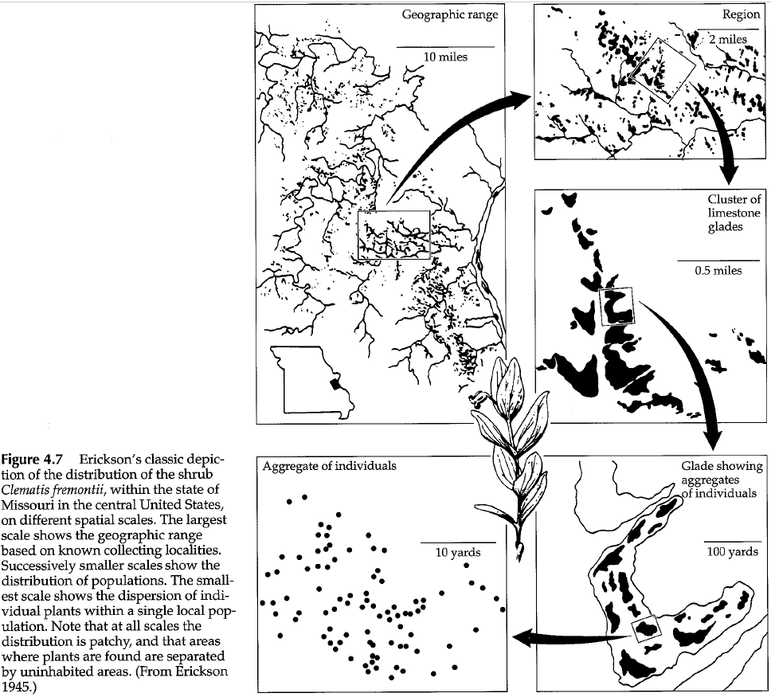
```
]

---

class: inverse, center, middle

# 2. Poblaciones en los Estudios de Distribución

---

## Tipos de Mapas de Distribución

.pull-left[
### 1. Mapas de Contorno (Outline)
- Área irregular sombreada
- Límites dibujados a mano
- Incluye estimaciones

### 2. Mapas de puntos (Dot)
- Localidades documentadas
- Registros de museo/observaciones
- Información precisa pero incompleta
]

.pull-right[
### 3. Mapas de isolíneas (Contour)
- Variación en abundancia
- Isolíneas de densidad
- Interpolación entre puntos

### 4. Mapas Combinados
- Puntos + ... + Isolíneas + ... + Rásters + otros
- Mayor información integrada
- Representación más completa
]

---

small: compact

.pull-left[
1. Mapas de Contorno (Outline)
```{r, out.width="140%", fig.align="center"}
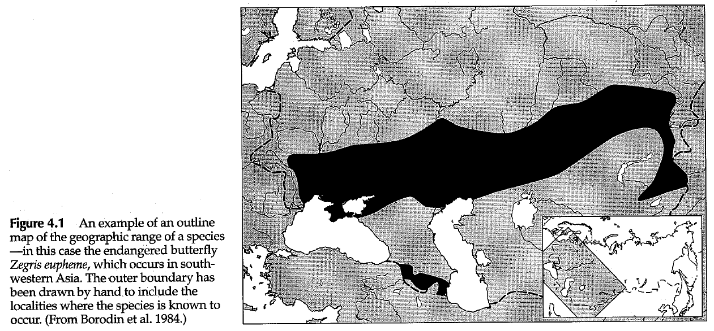
```

2. Mapas de puntos (Dot)
```{r, out.width="140%", fig.align="center"}
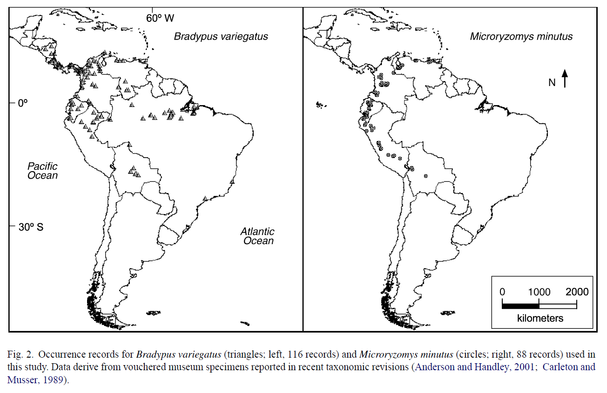
```
]

.pull-right[
3. Mapas de isolíneas (Contour)
```{r, out.width="140%", fig.align="center"}
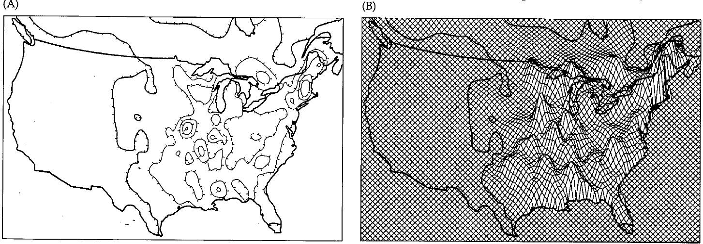
```

4. Mapas Combinados (e.g. rásters)
```{r, out.width="140%", fig.align="center"}
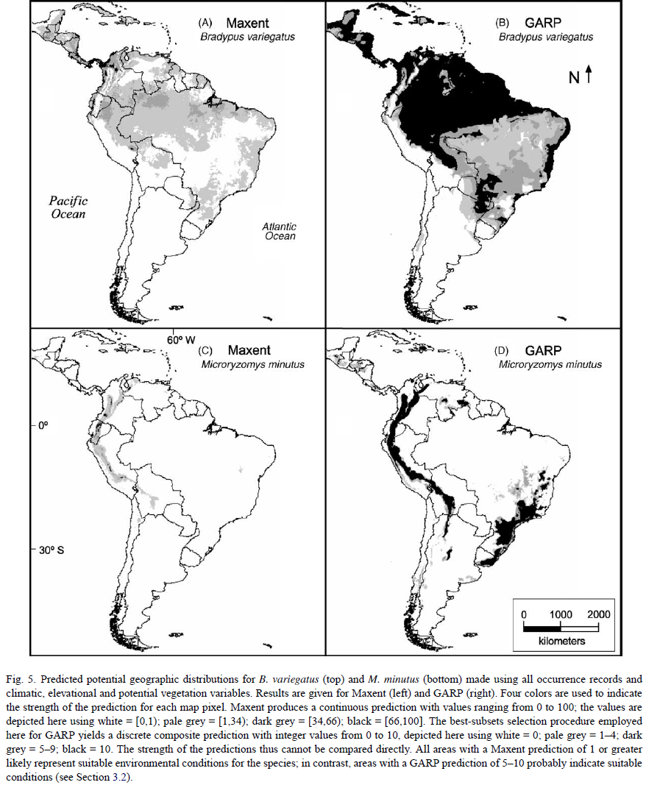
```
.small[
GARP: Genetic Algorithm for Rule-set Prediction.
]
]


---

# Dinámica Poblacional y Demografía

## Crecimiento Exponencial de Malthus (1798)

$$\frac{dN}{dt} = rN$$

Donde:
- **r** = tasa de crecimiento per cápita
- **r = b + i - d - e**
  - b = tasa de natalidad
  - i = tasa de inmigración  
  - d = tasa de mortalidad
  - e = tasa de emigración

---

class: compact

## Poblaciones Fuente y Sumidero

.pull-left[
### Poblaciones Fuente
- **b > d** (natalidad > mortalidad)
- **e > i** (emigración > inmigración)
- Producen individuos excedentes
- Mantienen poblaciones sumidero

### Poblaciones Sumidero
- **d > b** (mortalidad > natalidad)
- **i > e** (inmigración > emigración)
- Dependen de inmigración para persistir
- Comunes en bordes del ámbito
]

.pull-right[
```{r, out.width="100%"}
knitr::include_graphics("https://upload.wikimedia.org/wikipedia/commons/7/7f/Metapopulation.svg")
```
]

---

class: inverse, center, middle

# 3. Límites del Ámbito Geográfico

---

class: compact

# El Concepto de Nicho Multidimensional

## Hutchinson (1957)

.small[
.pull-left[
### Nicho como Hipervolumen
- **Espacio multidimensional**
- **Ejes** = variables ambientales
- **Volumen** = combinación de condiciones para supervivencia y reproducción

### Nicho Fundamental vs. Realizado (experimentos de Connell)
- **Fundamental**: Condiciones físicamente tolerables
- **Realizado**: Donde realmente ocurre (limitado por interacciones bióticas)
]
]
.pull-right[
```{r, out.width="45%"}
knitr::include_graphics("img/nicho_multidimensional.png")
```
.tiny[
*Ejemplo: Nicho bidimensional de una especie acuática hipotética*
]
]

---

.pull-left[
```{r, out.width="100%"}
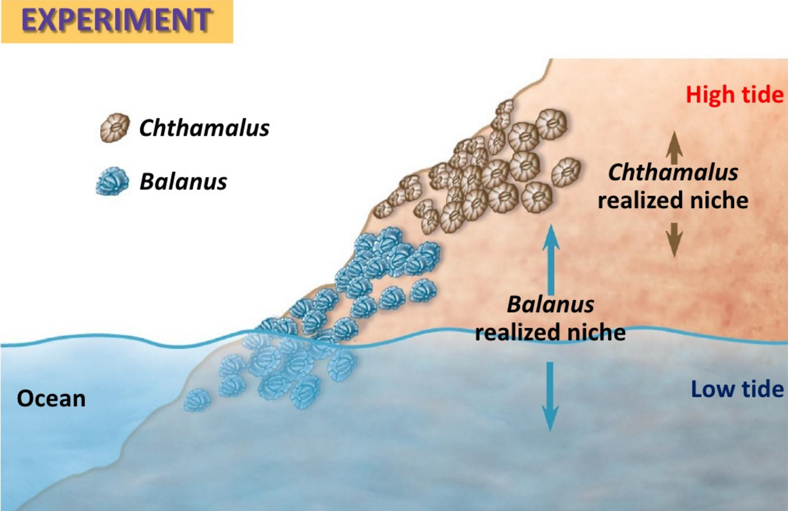
```
]

.pull-right[
```{r, out.width="100%"}
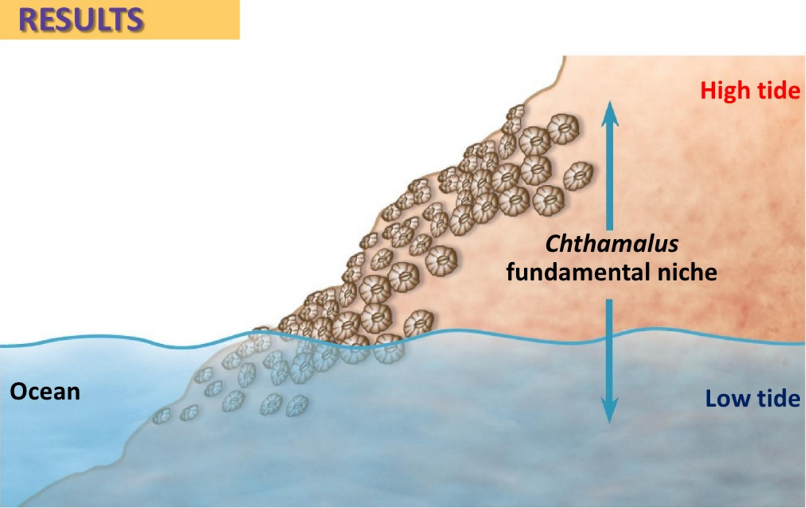
```
]

---

class: compact

## Factores Físicos Limitantes

### Principales Variables Abióticas

.pull-left[
1. **Temperatura**
- Límites térmicos críticos
- Interacción con otras variables
- Ejemplo: *Carnegiea gigantea*. OJO: cualquier IA te dirá que el *Pinus occidentalis* tiene límites térmicos críticos, pero no se ha medido.

2. **Química del Suelo/Agua**
- pH, salinidad, nutrientes
- Tolerancia osmorregulatoria
- Ejemplo: Great Salt Lake, lago Enriguillo, laguna de Oviedo, filtran fuertemente qué organismos prosperan
]

.pull-right[
3. **Disponibilidad de Agua**
- Estrés hídrico
- Adaptaciones xerofíticas vs. mesofíticas
- Trade-offs fisiológicos (especies xerofíticas invierten en ahorro de agua: cutículas gruesas, suculencia;  mesofíticas maximizan intercambio y crecimiento)
]

---

## Mensaje clave

- Los límites de distribución emergen de **umbrales fisiológicos + duración de la exposición** (temperatura/agua/química) y su **interacción con el ambiente local** (suelo, topografía, viento, etc.).

- En campo, hay que buscar **transiciones abruptas** (ecotonos) y **gradientes** (altitud, aridez, salinidad), pues ahí se "ven" los límites.

---

# Caso de Estudio: Saguaro (*Carnegiea gigantea*)

.pull-left[
## Limitación por Temperatura
- **Límite crítico**: -7°C
- **Sensibilidad**: Daño por heladas
- **Protección**: Árboles nodriza para juveniles
- **Correlación**: Límite norte = 12h continuas bajo 0°C
]

.pull-right[
```{r, out.width="100%"}
knitr::include_graphics("https://upload.wikimedia.org/wikipedia/commons/e/e2/Carnegiea_gigantea_range_map_3.png")
```

*Correspondencia entre distribución del saguaro y régimen de temperaturas invernales*
]

---
class: compact

# Interacciones con Otros Organismos

## Tipos de Interacciones Bióticas

.pull-left[
### 1. **Competencia**
- Intraespecífica e interespecífica
- Exclusión competitiva
- Ejemplo: Tamias (ardillas)

### 2. **Depredación**
- Incluyendo herbivoría y parasitismo
- Control biológico
- Ejemplo: Opuntia en Australia
]

.pull-right[
### 3. **Mutualismo**
- Polinización, dispersión
- Relaciones obligadas vs. facultativas
- Ejemplo: Acacia-Pseudomyrmex

### 4. **Interacciones Múltiples**
- Efectos indirectos
- Especies clave (keystone)
- Cascadas tróficas
]

---
class: compact

### Caso de Estudio: Competencia en Tamias. **Experimentos Naturales**

.pull-left[
**Patrón Normal**
- 2-3 especies por montaña
- Segregación por elevación
- Solapamiento mínimo

**Cuando Falta una Especie**
- Expansión del ámbito altitudinal
- Ocupación de todos los hábitats
- **Evidencia** de exclusión competitiva
- *Expansión de nicho cuando falta el competidor*
]

.pull-right[
```{r, out.width="80%"}
knitr::include_graphics("https://d9-wret.s3.us-west-2.amazonaws.com/assets/palladium/production/s3fs-public/styles/full_width/public/thumbnails/image/ChipmunkElevationMap_ChrisLowreyUSGS.jpg?itok=r5s0M6M9")
```
]
.tiny[
Distribución altitudinal de las ardillas listadas de Palmer (lim. inf. amarillo) y Panamint (lím. sup. rojo) en la cordillera Spring Range de Nevada.
]

---

class: inverse, center, middle

# 4. Patrones Derivados

---
class: compact

# Areografía: El Estudio de los Ámbitos

## Rapoport (1982) - Patrones Generales

.pull-left[
### 1. **Tamaño del Ámbito**
- Regla de Rapoport: ↑ latitud = ↑ tamaño de ámbito
- Variación entre taxones
- Excepciones y mecanismos

### 2. **Forma del Ámbito**
- Tendencia este-oeste en latitudes altas
- Distorsión por barreras geográficas
- Correlación con gradientes climáticos
]
.pull-right[
### 3. **Solapamiento de Ámbitos**
- ↓ latitud = ↑ solapamiento
- Hotspots de diversidad
- Patrones de endemismo
]

---

# Variación Interna del Ámbito

## Abundancia Poblacional

.pull-left[
### Patrones Observados:
1. **Autocorrelación espacial**
2. **Abundancia máxima** cerca del centro
3. **Abundancia baja** en los bordes
4. **Alta variabilidad** en el centro
5. **Excepción**: Bordes "duros" (costas)
]

.pull-right[
```{r, out.width="100%"}
knitr::include_graphics("https://via.placeholder.com/400x300/3F51B5/white?text=Gradiente+Abundancia%0ACentro+→+Periferia")
```

*Patrón típico: abundancia alta y variable en el centro, baja en la periferia*
]

---
class: compact

# Ecogeografía: Variación Fenotípica

## "Reglas" Ecogeográficas Clásicas

.pull-left[
### 1. **Regla de Bergmann**
- ↑ latitud = ↑ tamaño corporal
- Termorregulación (relación superficie/volumen)

### 2. **Regla de Allen**
- ↑ latitud = ↓ tamaño de apéndices
- Conservación de calor
]
.pull-right[
### 3. **Regla de Jordan**
- ↑ latitud = ↑ número de vértebras
- Peces: adaptación a temperatura
]

---

# Predicción de Ámbitos Fundamentales y Realizados

## Modelado de Distribución de Especies (SDM)

### Procedimiento General:

1. **Datos/registros de presencia/incidencia ("ocurrencias")** + variables ambientales
2. **Análisis estadístico** de afinidades ambientales  
3. **Modelado espacial** del ámbito fundamental
4. **Incorporación** de factores históricos/bióticos
5. **Validación** con datos independientes
6. **Refinamiento** iterativo
7. **Predicción** bajo escenarios futuros

---

# Aplicaciones del Modelado SDM

.pull-left[
## Conservación
- Identificación de hábitat crítico
- Planificación de reservas
- Evaluación de riesgo de extinción

## Cambio Climático
- Predicción de shifts de ámbito
- Identificación de refugios
- Planificación de corredores
]

.pull-right[
## Especies Invasoras
- Evaluación de riesgo de invasión
- Predicción de expansión
- Estrategias de control temprano

## Agricultura
- Predicción de plagas
- Zonificación de cultivos
- Manejo integrado
]

---

class: inverse, center, middle

# 5. Síntesis y Conceptos Clave

---
class: compact

# Síntesis: Factores Limitantes

## Patrón General Emergente
.pull-left[
### **Hipótesis Abiotic-Biotic**
- **Latitudes altas**: Limitación por estrés abiótico
- **Latitudes bajas**: Limitación por interacciones bióticas

### **Gradientes Locales**
- **Ambientes estresantes**: Dominan factores físicos
- **Ambientes benignos**: Dominan interacciones biológicas
]
.pull-right[
### **Implicaciones**
- Predicción de respuestas al cambio climático
- Estrategias de conservación diferenciadas
- Comprensión de gradientes de diversidad
]

---

# Conceptos Clave para Recordar

.pull-left[
## Fundamentales
1. **Ámbito geográfico** = unidad básica
2. **Nicho multidimensional** de Hutchinson
3. **Fundamental vs. Realizado**
4. **Poblaciones fuente-sumidero**
5. **Dependencia de escala**
]

.pull-right[
## Aplicados
1. **Modelado de distribución**
2. **Patrones areográficos**
3. **Reglas ecogeográficas**
4. **Limitación abiotic-biotic**
5. **Predicción de cambios**
]

---
class: compact

# Conexiones con Otras Áreas

.small[
.pull-left[
## Ecología (Smith & Smith)
- **Poblaciones**: Crecimiento, regulación, metapoblaciones
- **Comunidades**: Interacciones especies, estructura trófica
- **Ecosistemas**: Flujos de energía, ciclos biogeoquímicos

## Evolución
- **Especiación alopátrica**: Aislamiento geográfico (vicariante o dispersión)
- **Especiación simpátrica**: Sin aislamiento (divergencia en nichos ecológicos o poliploidía)
- **Selección natural**: Adaptación local
- **Deriva genética**: Poblaciones pequeñas en bordes
]

.pull-right[
## Conservación
- **Diseño de reservas**: Ámbitos críticos
- **Fragmentación**: Poblaciones fuente-sumidero
- **Cambio global**: Modelado predictivo
]
]
---

class: center, middle

# Preguntas y Discusión

## ¿Qué factores creen que serán más importantes para limitar distribuciones de una especie en el contexto del cambio climático?

## ¿Cómo podemos usar el modelado de distribución de especies para conservación en RD?

---

class: center, middle, inverse

# Distribución de Comunidades

---

class: compact, centered

# ANTES DE COMENZAR: Definiciones importantes, relevantes en botánica pero extensibles a otros reinos\*

.footnote[
*Fuente (todas las definiciones): [https://mexbot.tripod.com/definiciones_importantes.htm](https://mexbot.tripod.com/definiciones_importantes.htm)
]

---

class: compact

.pull-left[

### Abundancia

.box-small-margin[
Número total de individuos de una especie o especies que existe en un área, volumen, población o comunidad; abundancia absoluta; con frecuencia, en las plantas se mide como cobertura, área basal, densidad, etc. (véase Valores de Importancia).
]

### Área basal

.box-small-margin[
Es el área ocupada por secciones transversales de tallos a 1.3 m sobre el suelo (u otras medidas basales vegetales) por unidad de área de la superficie del terreno.
]
]

.pull-right[

### Biomasa de una especie

.box-small-margin[
Es la masa total (generalmente peso seco de materia orgánica) presente en un momento determinado por unidad de área de la superficie del terreno.
]

### Cobertura

.box-small-margin[
Es el porcentaje del área de la superficie del terreno (u otro sustrato) sobre el cual se encuentra follaje de una especie determinada.
]
]

---

class: compact

.pull-left[

### Densidad

.box-small-margin[
El número de individuos de una especie por unidad de superficie del área de terreno (u otra medida espacial).
]

### Diversidad alfa

.box-small-margin[
La composición florística dentro de un hábitat o comunidad particular.
]
]

.pull-right[

### Diversidad beta

.box-small-margin[
El cambio en la composición florística a lo largo de una cenoclina.
]

### Frecuencia

.box-small-margin[
Es el porcentaje de submuestras dentro de un cuadrante de muestreo mayor, en que una especie determinada está presente.
]
]

---

class: compact

### Cenoclina

.box-small-margin[
Un gradiente en la comunidad vegetal. El cambio gradual en los valores de importancia de los diferentes componentes florísticos de la comunidad, que expresan los cambios ambientales correspondientes de un gradiente complejo. Por ejemplo, el área basal de cada especie en la comunidad  aumenta o disminuye concomitantemente con los cambios ambientales a lo largo del gradiente ambiental, según se acerque o aleje de los sitios de mayor éxito en la competencia con las otras especies.
]

---

class: compact

.pull-left[

### Ecoclina

.box-small-margin[
Un gradiente complejo, junto con su cenoclina correspondiente, forman un gradiente de comunidades-y-ambientes (es decir, de ecosistemas), llamado ecoclina.
]

### Ecotipos

.box-small-margin[
Diferentes óptimos adaptativos en cuanto a la respuesta genética al ambiente. Gráficamente, se muestran como curvas bimodales o polimodales, conectadas o discontinuas. En la mayoría de los casos existen diferencias morfológicas entre los diferentes ecotipos de una especie.
]
]

.pull-right[

### Gradiente complejo

.box-small-margin[
Es un gradiente ambiental donde cambian simultáneamente varios factores ambientales diferentes a lo largo del mismo espacio. Por ejemplo, al aumentar la altitud en la ladera de una montaña, cambian también diferentes factores ambientales como la precipitación y la humedad, la temperatura y velocidad del viento, así como las características del suelo.  (v. cenoclina).
]
]

---

class: compact

.pull-left[

### Producción neta de una especie

.box-small-margin[
En cuanto a plantas, es el crecimiento total en peso seco (o su equivalente en términos de energía), o la producción de materia orgánica a través de la fotosíntesis, menos la respiración de las mismas plantas.
]
]

.pull-right[

### Valores de importancia

.box-small-margin[
Medidas que expresan en forma relativa la abundancia, o la conspicuidad, "la grandeza" o el vigor de una especie. Por ejemplo, la densidad, la cobertura o el área basal, la frecuencia o la biomasa o producción neta de una especie.
]
]

---

class: compact

.pull-left[

### Valores de importancia relativos

.box-small-margin[
Las medidas indicadas en la definición de valores de importancia para una especie, con frecuencia se dividen entre el total del valor de importancia de la misma clase obtenido para todas las especies de una muestra. Los porcentajes resultantes son los valores de importancia relativos.
]
]

.pull-right[

### Valores de importancia sintéticos

.box-small-margin[
Cuando se combinan dos o más valores de importancia. Por ejemplo, el Valor de importancia sintético de Wisconsin (Curtis y McIntosh 1951, Goff y Cottam 1967) suman, para cada especie, la densidad relativa, la frecuencia relativa y el área basal relativa.
]
]

---

class: compact

### Bibliografía para las definiciones


- Curtis, J. T. y R. P. McIntosh. 1951. An upland forest continuum in the prairie-forest border region of Wisconsin. Ecology 32: 476-496.


- Goff, F. G. y G. Cottam 1967. Gradient analysis: the use of species and synthetic indices. Ecology 48: 793-806.


- Lincoln, R. J., G. A. Boxshall y P. F. Clark. 1995. Diccionario de ecología, evolución y taxonomía. Fondo de Cultura Económica. México. 488 pp.

- Whittaker, R. H. 1978. Direct gradient analysis. in: R. H. Whittaker (ed.). Ordination of Plant Communities. Dr. Junk. The Hague. pp. 7-50.

---

## AHORA SÍ, COMENCEMOS "DISTRIBUCIÓN DE COMUNIDADES".

## Introducción

Definiciones, algo arbitrarias pero útiles para separar conceptos:

- **Población:** Grupo de individuos de la **misma especie** que viven en un área determinada.
- **Comunidad:** Conjunto de **poblaciones de diferentes especies** que interactúan en un área.
- **Hábitat:** **Entorno** "natural" donde vive una especie.
- **Ecosistema:** **Comunidad** de seres vivos **y su entorno** físico interactuando como un sistema.
- **Bioma:** **Gran región** caracterizada por un tipo específico de clima, flora y fauna.

---

## Introducción

* **Distribución y abundancia** de una especie siempre resultan afectados por otras especies.

* Debido a las interacciones entre organismos, normalmente las distribuciones de especies suelen ser **mutuamente excluyentes a escala local**, o tienden a ocurrir de forma conjunta en complejas comunidades ecológicas.

* Las comunidades vistas como un superorganismo se atribuye a **Clements** (especies como células).

* En contraste, la comunidad vista como unidad discreta e integrada, se atribuye a **Gleason**.

---

## Introducción (cont.)

* Ambas corrientes hicieron aportes relevantes.
    * Las comunidades exhiben **atributos como los de un individuo** ("productividad primaria total").
    
    * Por otra parte, las especies también varían en incidencia (*ocurrence*) y abundancia **como si fuesen organismos independientes** unos de otros.

* Climas diferentes inducen tipos de __vegetación distintos__ (zonas de vida, biomas, ecorregiones).

---

## Introducción (cont.)

* Ejemplos: ...

* Consultar ["Ecoregion"](https://en.wikipedia.org/wiki/Ecoregion), versión en inglés. Aportaciones de Dasmann (1972) y @udvardybiogeographical

* Consultar Mapa de tipos de regímenes bioclimáticos, @olson1998global @olson2001terrestrial

* Consultar mapas modelos idealizados, pags. 15 y 39 de @bailey2014ecoregions.

* Consultar Mapa de tipos de regímenes bioclimáticos, @camara2020tbrs

---

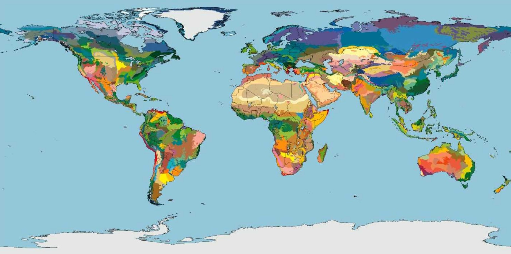

Tomado de @olson2001terrestrial

---

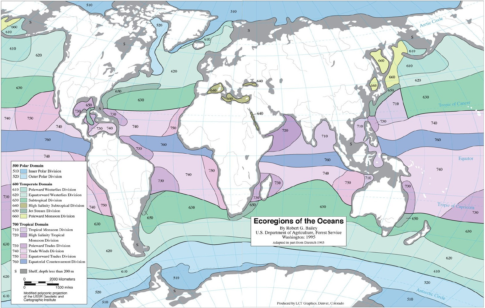

Tomado de @bailey2014ecoregions

---

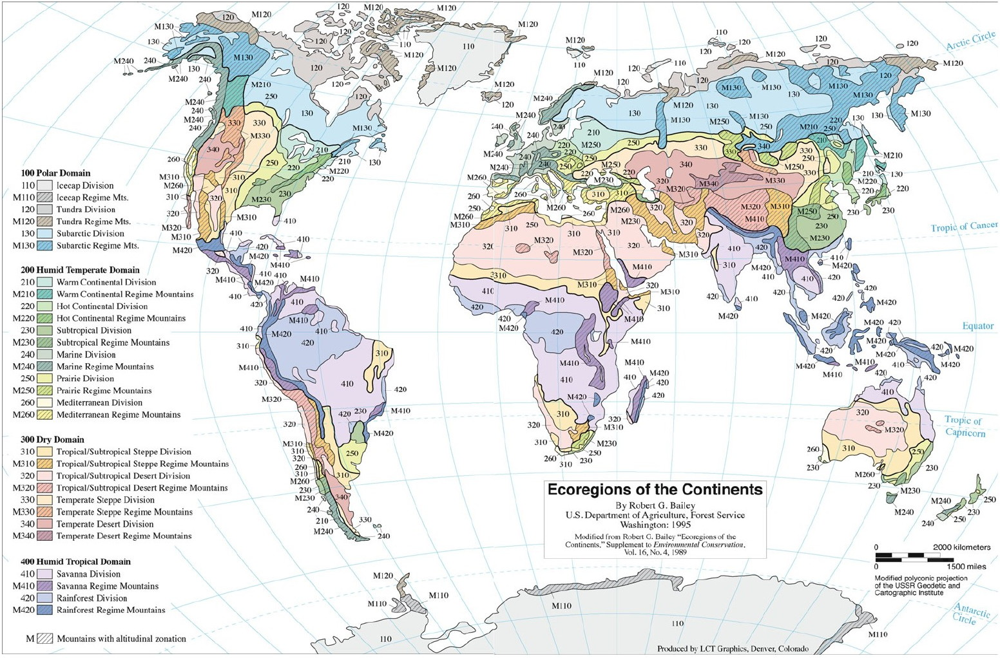

Tomado de @bailey2014ecoregions

---

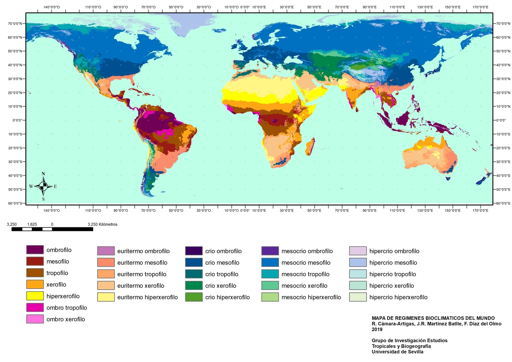

Tomado de @camara2020tbrs

---

## Introducción (cont.)

* Mencionar/mostrar Hager y Zanoni (1993), mapas de Tolentino y Peña (1998) y Cano y Cano (2014)

---

.pull-left[
```{r, out.width="90%"}
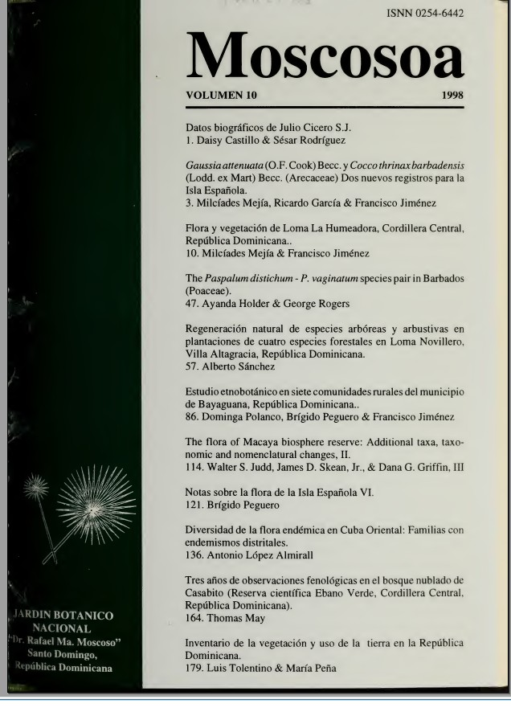
```
]

.pull-right[
```{r, out.width="90%"}
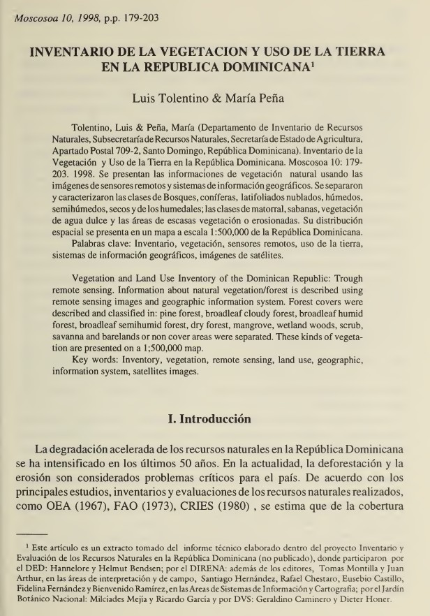
```
]

---


---
class: center, middle, inverse

## Comunidades y ecosistemas

---

## Comunidades y ecosistemas

* Je je, __tremendo lío__, definiciones arbitrarias.

* Las comunidades y los ecosistemas son los niveles de organización biótica y ecológica __más altos__, pero comúnmente se definen de forma arbitraria.

---

## Comunidades y ecosistemas (cont.)

### Comunidad

* La comunidad consiste en el __conjunto de especies que viven en el mismo lugar__.

* Un miembro de la comunidad puede definirse __taxonómicamente__ o por medio de atributos/rasgos __funcionales__ (e.g. formas de vida, dieta).

* Dos atributos son recurrentemente estudiados en la comunidad: __estructura__ (atributos estáticos) y __funciones__ (atributos dinámicos).

* Los límites se establecen __arbitrariamente__, aunque los __rasgos topográficos__ son usados también.

---

## Comunidades y ecosistemas (cont.)

### Ecosistemas

* Incluye no sólo las especies que habitan en el lugar, sino también los __rasgos/atributos/características físicas__ del mismo, así como las interacciones entre los componentes bióticos y abióticos del sistema.

* __Los ecosistemas no están aislados__, aunque lo parezcan. El ecosistema más grande y aislado del resto es la biosfera, pero dentro de ella, es difícil separar subunidades que se consideren absolutamente aisladas.

---

## Comunidades y ecosistemas (cont.)

### Consideraciones energéticas

* Cada __especie tiene un nicho, y el cómo se organizan__ para dar lugar a asociaciones complejas entre poblaciones, __es el objetivo último de la ecología__.

* Dos rasgos fundamentales de las especies que influyen en la comunidad son su __masa/volumen corporal__ y su __estado trófico o condición trófica__.

---

## Comunidades y ecosistemas (cont.)

### Consideraciones energéticas (cont.)

#### Masa corporal

* Su influencia sobre el ecosistema es significativamente alta.

* A __mayor tamaño/masa, mayor consumo__ energético. La tasa de metabolismo basal es clave; $m=cM^{0.75}$, donde $m$ es la tasa de metabolismo basal, $M$ la masa corporal, $c$ una constante que varía entre grupos taxonómicos; el exponente $0.75$, que es la pendiente, es relativamente constante.

---

## Comunidades y ecosistemas (cont.)

### Consideraciones energéticas (cont.)

#### Masa corporal

* Hay más especies de animales pequeños, y son igualmente más abundantes, que grandes.

* Las __especies grandes__ (al menos en animales), tienden a tener __ámbitos geográficos amplios__.

---

## Comunidades y ecosistemas (cont.)

### Consideraciones energéticas (cont.)

#### Masa corporal

* La __capacidad de carga__ del ambiente es limitada, por lo que los animales grandes tienden a aumentar su rango para compensar esta limitación.

* Ver figuras 5.2 y 5.3, páginas 125 y 126 de @lomolino2006biogeography.

---

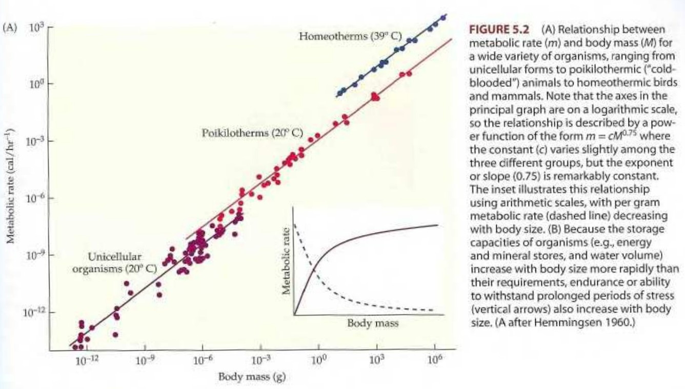

Tomado de @lomolino2006biogeography

---

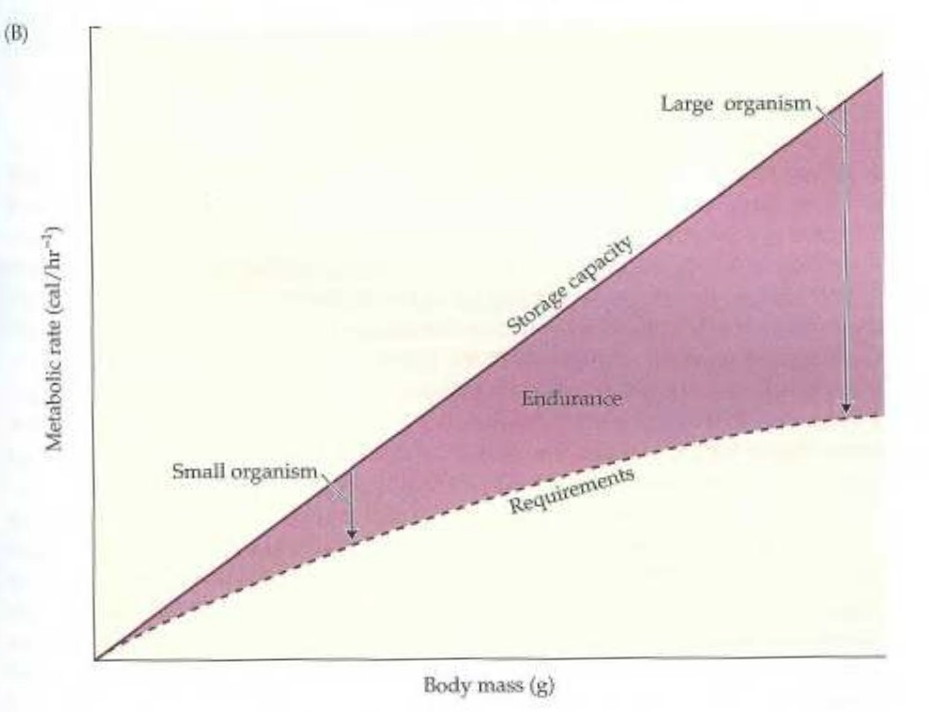

Tomado de @lomolino2006biogeography

---

## Comunidades y ecosistemas (cont.)

### Consideraciones energéticas (cont.)

#### Estado trófico

* Se refiere a __cómo los organismos adquieren su energía__, y es el otro rasgo que influye significativamente en la comunidad.

* El tamaño corporal tiene efecto sobre el estado trófico. Los __depredadores suelen ser más grandes que su presa__, a menos que la especie realice caza en manadas.

---

## Comunidades y ecosistemas (cont.)

### Consideraciones energéticas (cont.)

#### Estado trófico

* Los organismos obtienen __su energía del sol__ (salvo contadas excepciones).

* Las plantas, autótrofos, producen __compuestos orgánicos a partir de radiación solar__, dióxido de carbono, minerales y agua.

* __Además de usarlo en su metabolismo, las plantas producen estos compuestos para otros organismos__ que se alimentan de ellos, y otros organismos se alimentan de estos últimos.

---

## Comunidades y ecosistemas (cont.)

### Consideraciones energéticas (cont.)

#### Estado trófico

* El diseño de trayectorias unidireccionales de la energía que fluye entre especies y a través de comunidades se denomina __cadenas tróficas__. Los nodos de la misma se denominan __niveles tróficos__.

* El primer nivel contiene plantas, o __productores primarios__. El segundo contiene herbívoros, o __consumidores primarios__. El tercero __carnívoros__ o consumidores, y así sucesivamente. Al final de las cadenas están los __descomponedores o detritívoros__.

---

## Comunidades y ecosistemas (cont.)

### Consideraciones energéticas (cont.)

#### Estado trófico

* Aunque la __energía fluye linealmente__, los trayectos que sigue la energía son muy variados. Un consumidor se alimenta comúnmnente de __varias especies__, y varios __descomponedores lo consumirán__, formando una red trófica (distintas cadenas interconectadas; ver figura 5.5, página 127 de @lomolino2006biogeography).
* La energía fluye a través de las comunidades siguiendo la __primera__ (la energía ni se crea ni se destruye) y la __segunda ley de la termodinámica__ (a mayor conversión de la energía, menor su capacidad de producir trabajo, su caos/entropía aumenta).

---

## Comunidades y ecosistemas (cont.)

### Consideraciones energéticas (cont.)

#### Estado trófico

* Capacidad de carga: __energía utilizable de un hábitat__. La capacidad de carga de un hábitat para estados tróficos altos normalmente es baja.

* Pirámides de flujo energético. Estados tróficos más altos disponen de menor cantidad de energía.

---

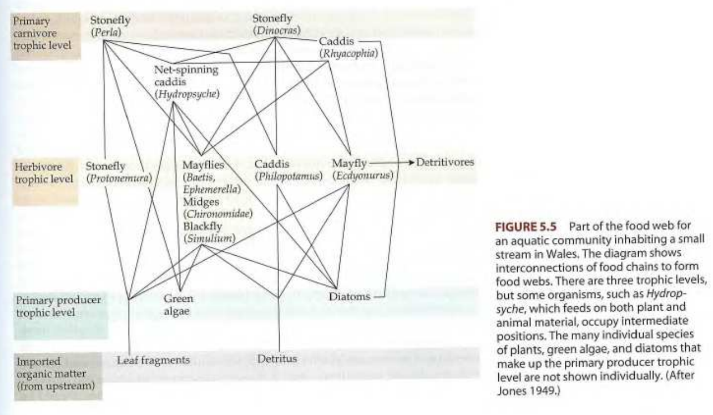
Tomado de @lomolino2006biogeography

---

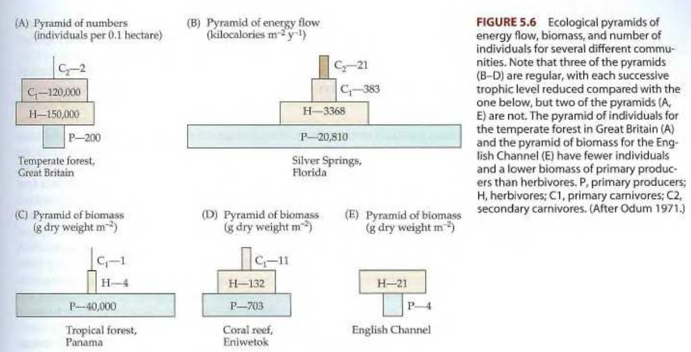
Tomado de @lomolino2006biogeography

---
class: center, middle, inverse

## Distribución de comunidades en espacio y tiempo

---

## Distribución de comunidades en espacio y tiempo

### Patrones espaciales

* Si somos capaces de identificar borde (__ecotono__) entre dos hábitat muy parecidos, teóricamente debería encontrarse una __mayor riqueza númerica de especies__ en el ecotono que en cualquiera de los hábitat que éste separa.

* __Cenoclina__ (*coenocline*): patrones de distribución de comunidades a lo largo de un __gradiente ambiental o geográfico__.

---

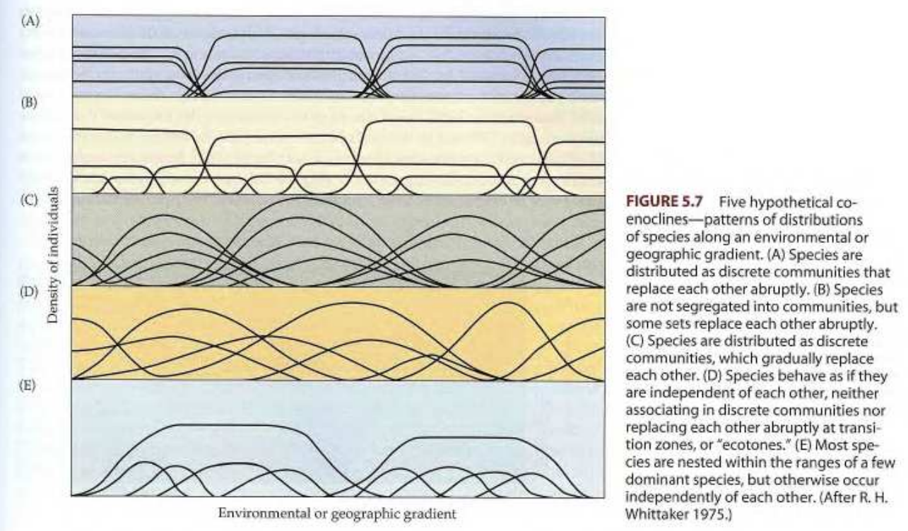
Tomado de @lomolino2006biogeography

---

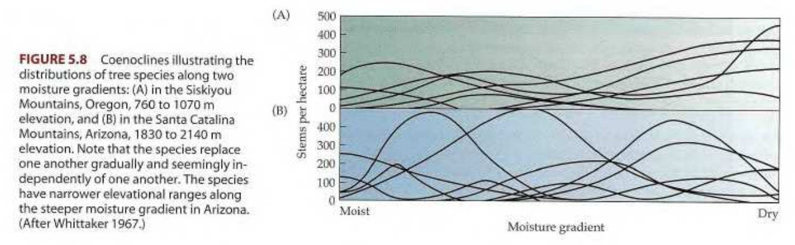
Tomado de @lomolino2006biogeography

---

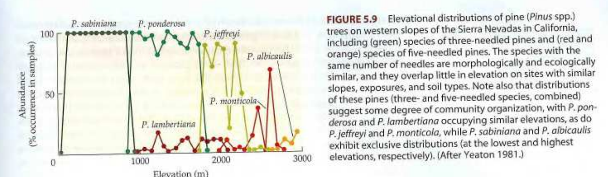
Tomado de @lomolino2006biogeography

---

.pull-left[
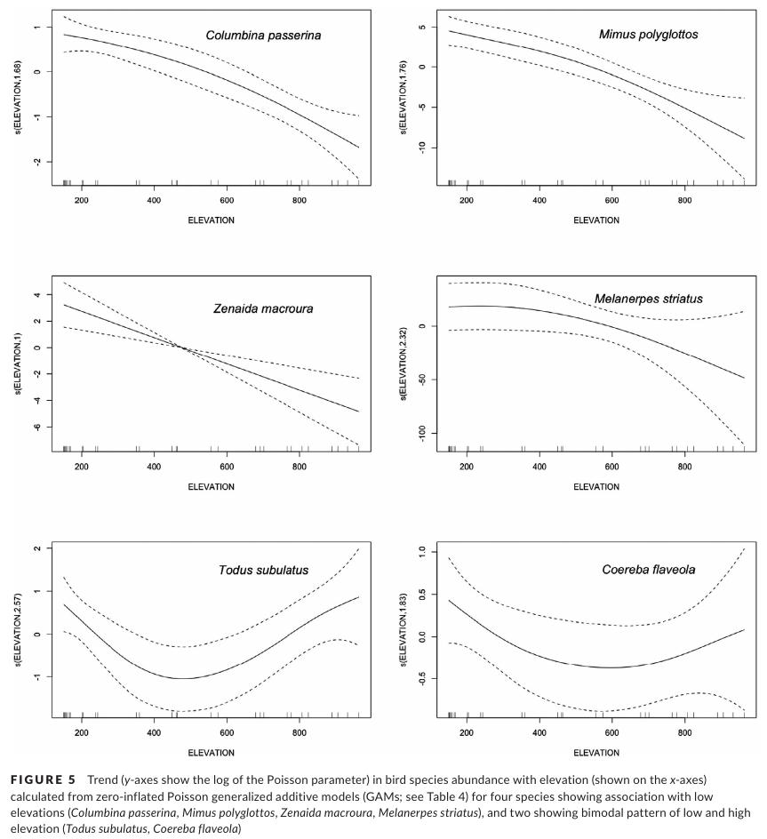
]
.pull-right[
Tomado de @franklin2019changing
]

---

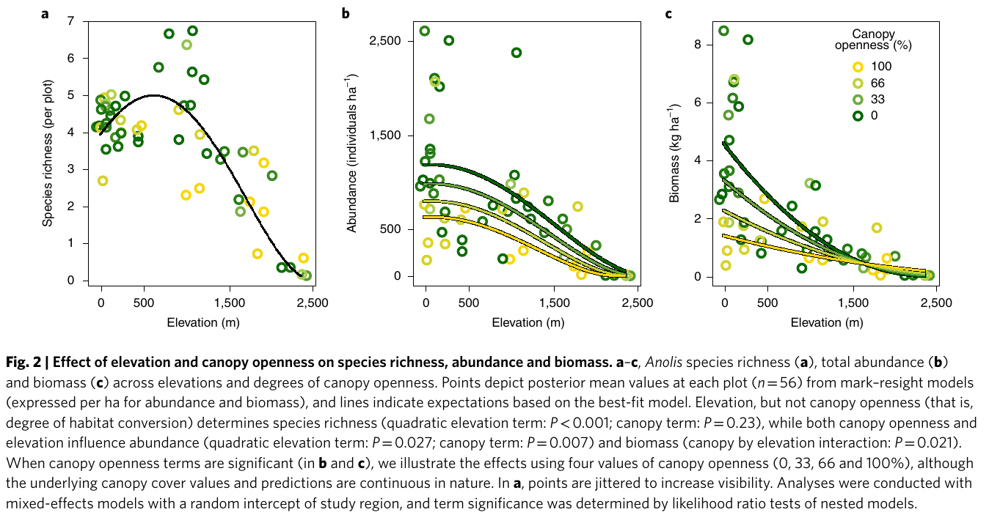

---

.pull-left[
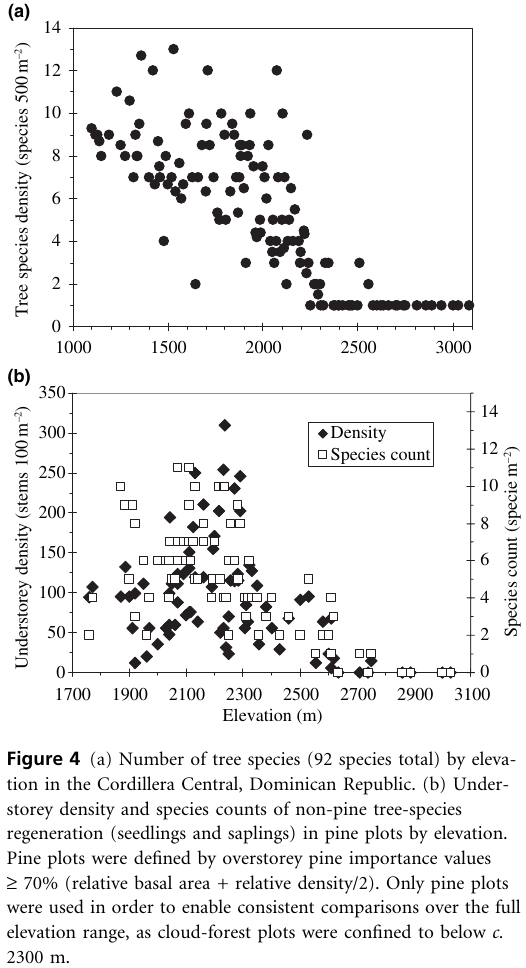
]
.pull-right[
Tomado de @martin2007tropical
]

---

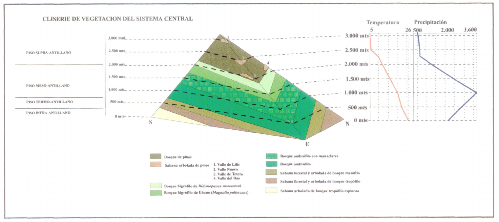
Tomado de @camara1997republica

---
class: center, middle, inverse

## Patrones temporales

---

## Patrones temporales

* __Cowles, Clements y Gleason__ realizaron aportaciones que sentaron las bases de la __sucesión__.

* __Sucesión__: proceso de cambio o reemplazo de especies o comunidades ecológicas enteras en el tiempo.

* La sucesión es un proceso común en cualquier ecosistema. En los ecosistemas las __alteraciones pueden ser repetidas, y eliminar comunidades enteras__.

---

* Clements entendía que la comunidad era como un __organismo que "nace, crece, madura y muere"__. 

* Propuso el concepto de "__comunidades serales__" o seras, como estadíos intermedios del ecosistema que siguen un __patrón predecible y determinista__, para converger en una __comunidad clímax__ (propuesto también por Clements) o estable con su ambiente (principalmente el factor clima), con independencia de sus condiciones de partida. 

---

* Clements dominó durante mucho tiempo el concepto de sucesión y sus derivados, como son sucesión primaria y secundaria.

* __Sucesión primaria__: cuando __la alteración__ (como un glaciar o una erupción volcánica) __quita suelo y materia orgánica__ (ambientes terrestres).

* __Sucesión secundaria__: cuando __la alteración__ quita todos los seres vivos pero __deja indicios del ecosistema anterior__ (e.g. individuos sobrevientes, semillas).

---

* La __sucesión__ en ecología sigue siendo un __campo de batalla__ entre quienes estudian patrones temporales.

* El debate __Clements-Gleason__ es el más temprano en una larga historia sobre cómo se produce la sucesión.

* En contraposición a la visión predecible y determinista de Clements, __Gleason__ apuntó que había una __gran diversidad de etapas serales y comunidades clímax (o climácicas) alternas__.

* Como corolario, Gleason señaló que la sucesión es un proceso dirigido por __interacciones entre especies y modificaciones locales producidas por la propia comunidad__.

---

## Patrones temporales (cont.)

### Paleoecología

* La biota regional es influenciada por __cambios climáticos, edáficos y físico-químicos en el agua__ que ocurren en el tiempo.

* "Tiempo" puede abarcar desde __ayer hasta centenares de millones de años__.

* El estudio del registro fósil a partir de la __paleontología__, es determinante y de uso común en estudios paleoecológicos

* Los estudios con __polen y roedores__ son muy utilizados en cambios geológicos recientes.

---

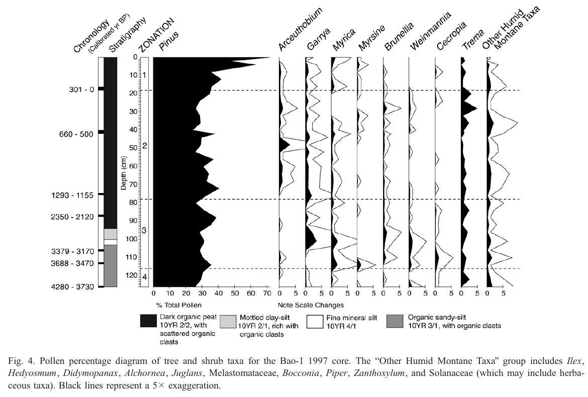

Tomado de @kennedy20064000

---

class: center, middle, inverse

## Biomas terrestres

---

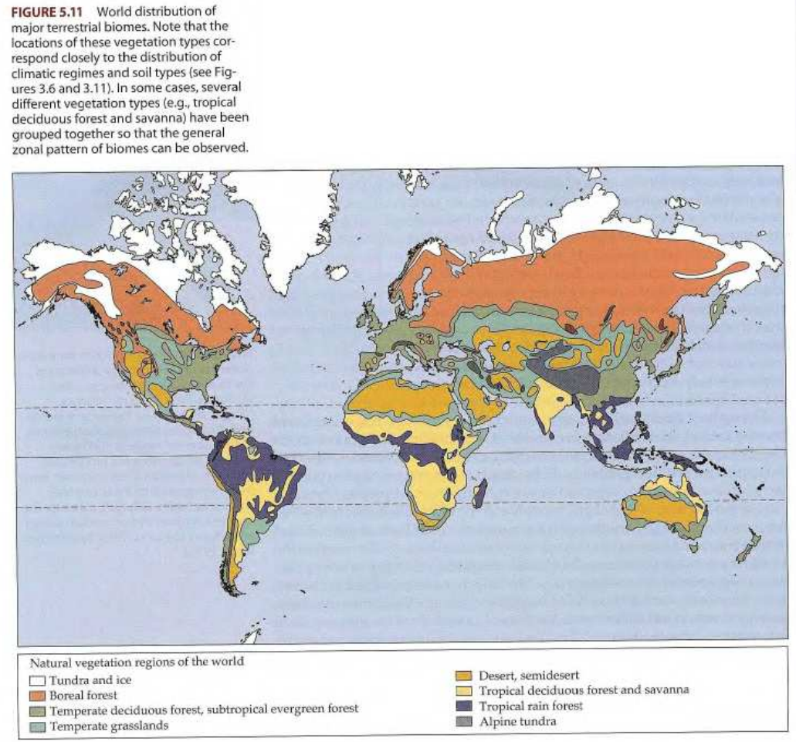

Tomado de @lomolino2006biogeography

---


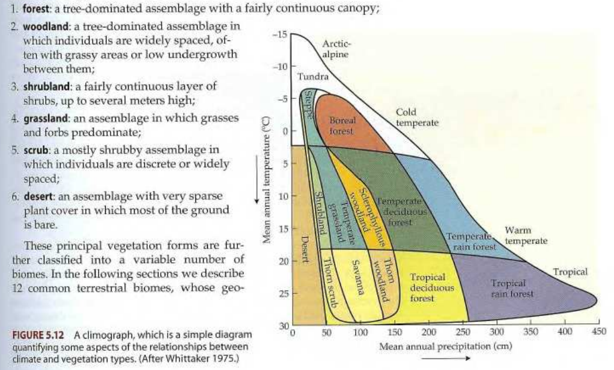

Tomado de @lomolino2006biogeography

---
class: center, middle, inverse

## Biomas tropicales

---

## Biomas tropicales

[Ver presentación separada media/tropicalidad_biomas_tropicales.odp](media/tropicalidad_biomas_tropicales.odp)

* Bosque lluvioso tropical

* Bosque deciduo o semideciduo tropical

* Matorral xerófilo / monte espinoso

* Sabana

---
class: center, middle, inverse

## Biomas no tropicales

---


---

## Biomas no tropicales (cont.)

* Desiertos cálidos y semidesiertos:

    * Ocurren en clima templado.
    
    * 30° a 40° N y S.
    
    * Menos de 250 mm de lluvia anual.
    
    * Déficit hídrico (mayor evaporación que precipitación).
    
    * Típicamente, la vegetación, cuando la hay, es dispersa y se compone de plantas suculentas.

---

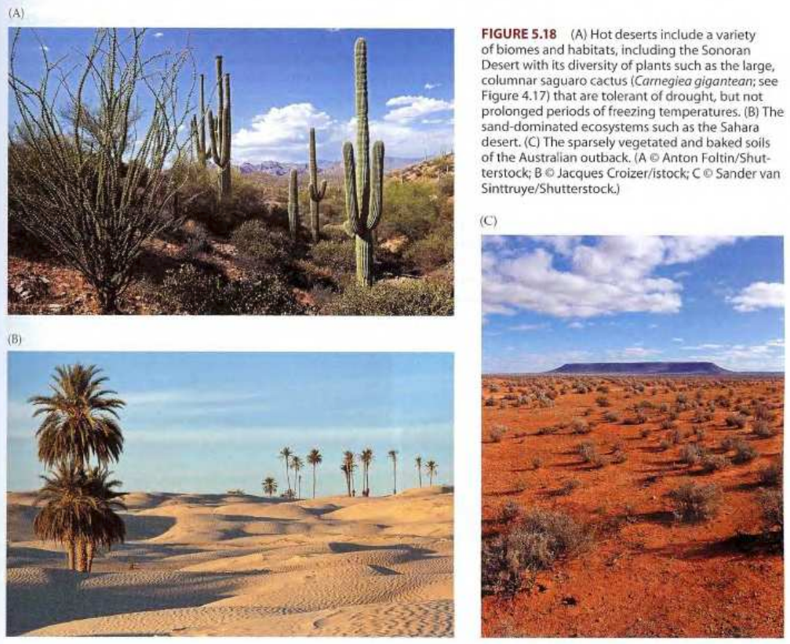

---

## Biomas no tropicales (cont.)

* Monte esclerófilo:

    * Ocurren en clima templado.
    
    * Lluvia invernal moderada pero verano seco y largo.
    
    * Plantas esclerófilas (hoja dura, pequeña, coriácea), y pueden existir coníferas.

---

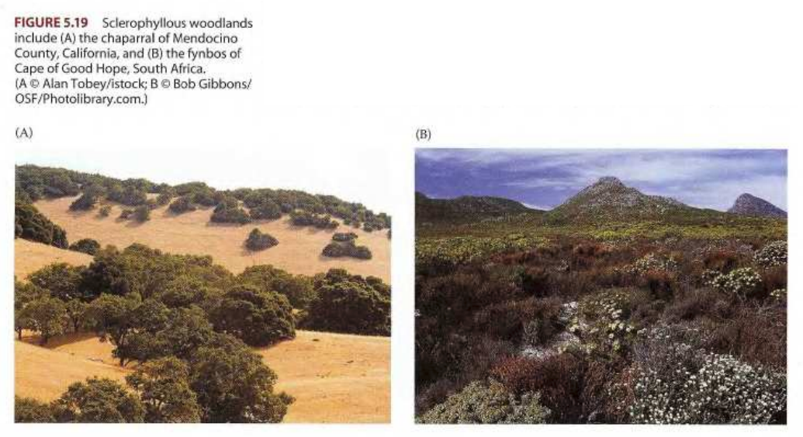

---

## Biomas no tropicales (cont.)

* Bosque siempreverde subtropical

    * Ocurren en clima templado.
    
    * Bosques de encino(roble) y lauráceas.
    
    * Reciben más de 1500 mm de precipitación anual.
    
    * La temperatura promedio anual no puede ser de menos de 13°C, ni pueden ocurrir heladas severas.
    
---

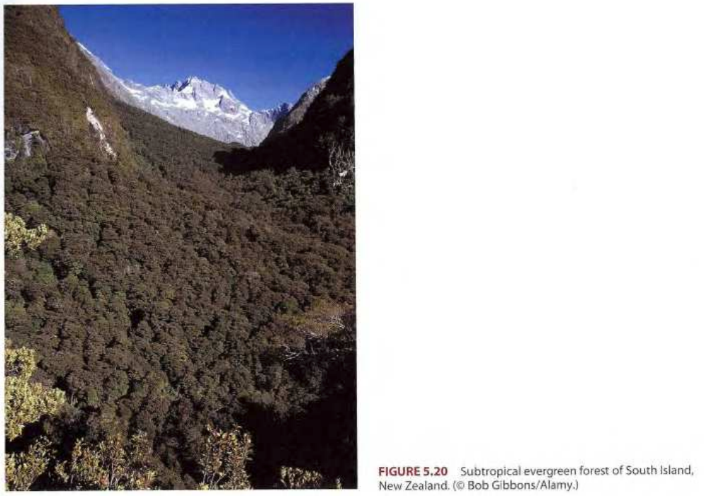

---

## Biomas no tropicales (cont.)

* Bosque templado deciduo

    * Ocurren en clima templado, pero comúnmente donde hay suficiente agua durante el verano para soportar los árboles grandes.
    
    * Los árboles pierden la hoja desde el otoño, y permanecen sin ella en invierno; rebrotan en primavera.
    
    * Estos bosques varían mucho en su composición y su estructura.
    
    * El sotobosque puede ser muy denso y diverso.

---

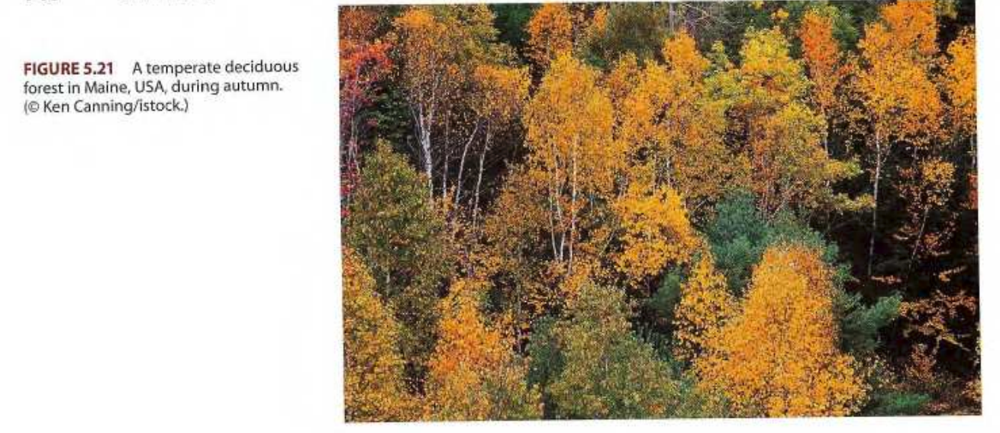

---

## Biomas no tropicales (cont.)

* Bosque templado lluvioso

---

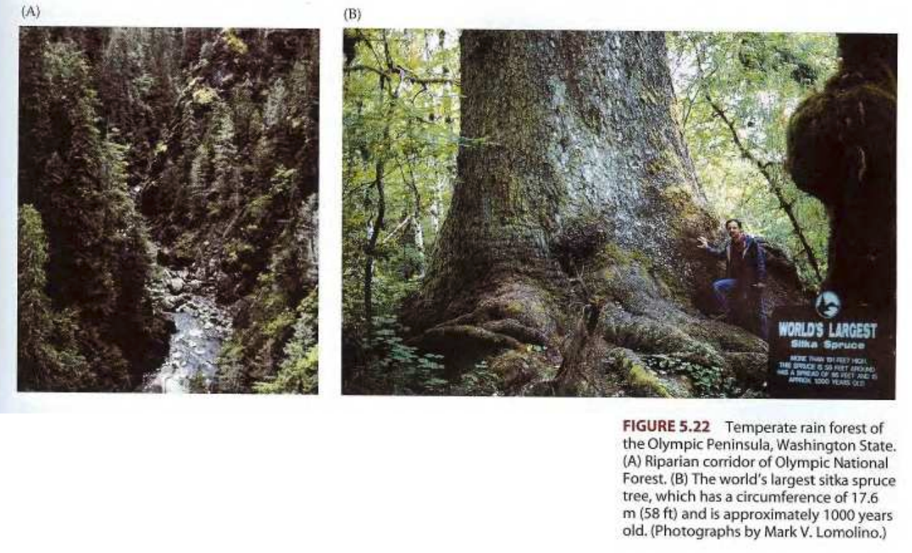

---

## Biomas no tropicales (cont.)

* Herbazales templados

---

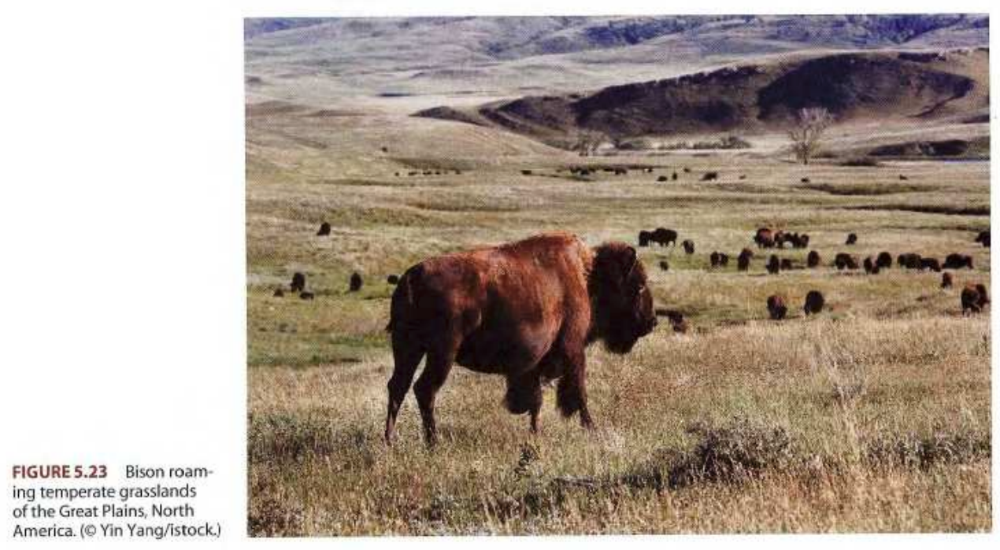

---

## Biomas no tropicales (cont.)

* Bosque boreal (taiga)

---

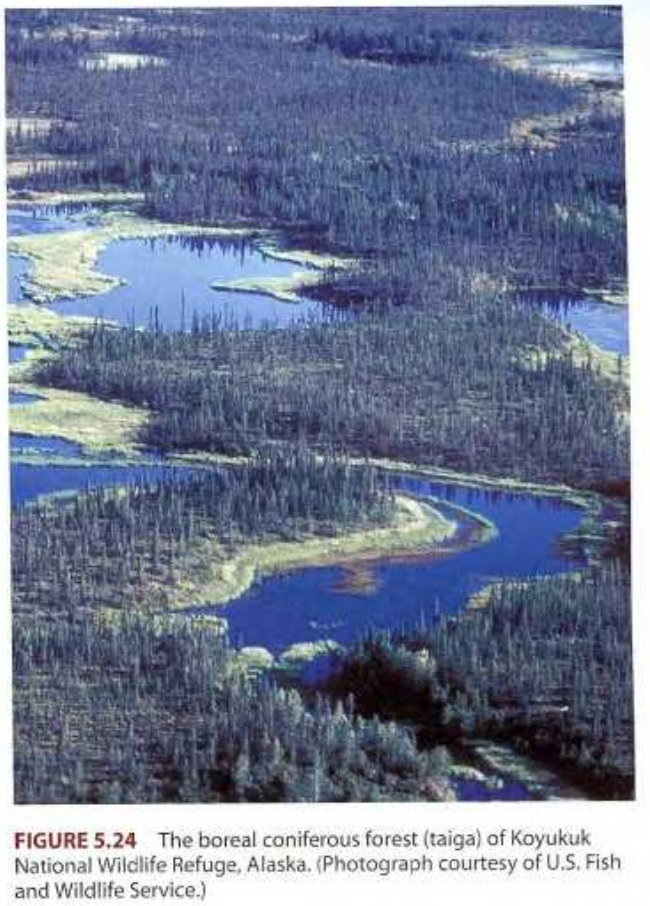

---

## Biomas no tropicales (cont.)

* Tundra

---

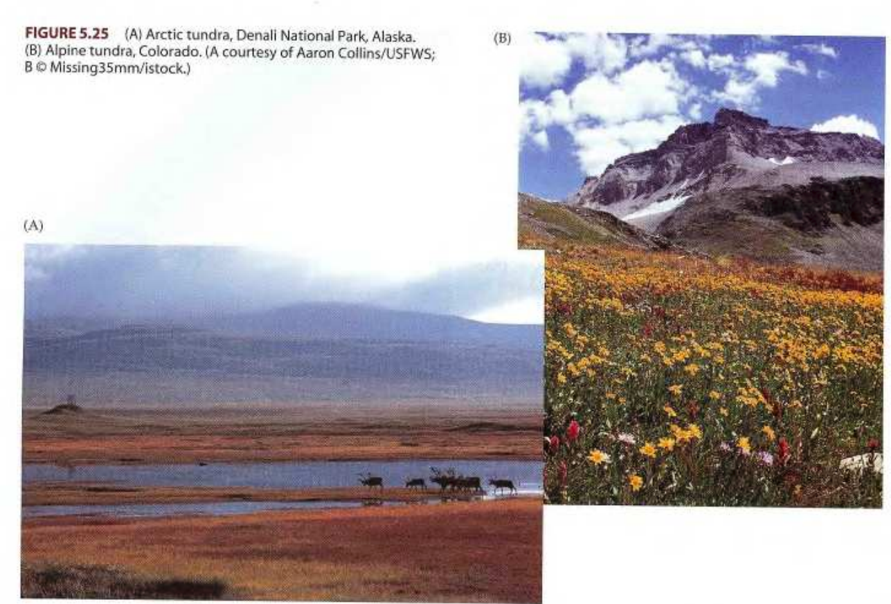

---
class: center, middle, inverse

## Comunidades acuáticas

---

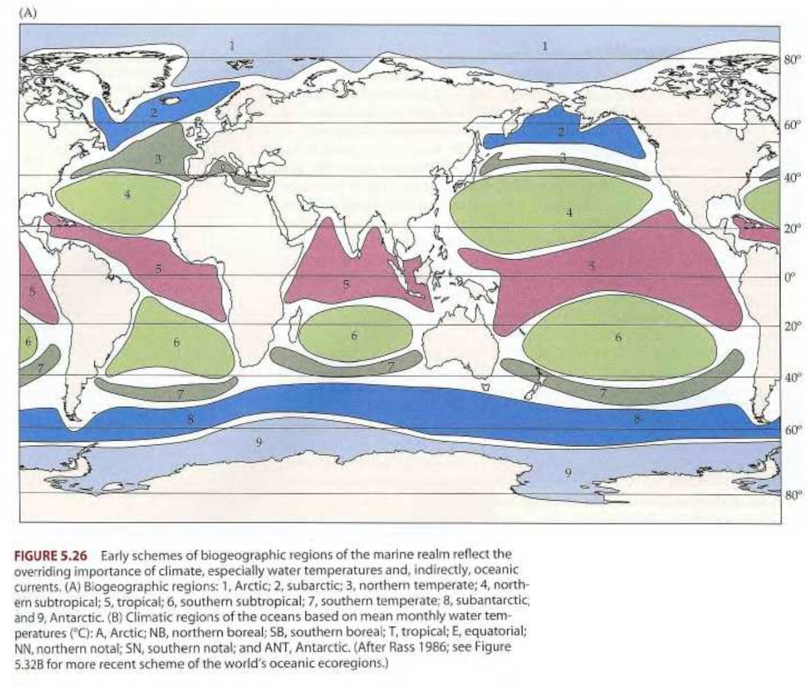{width=85%}

---

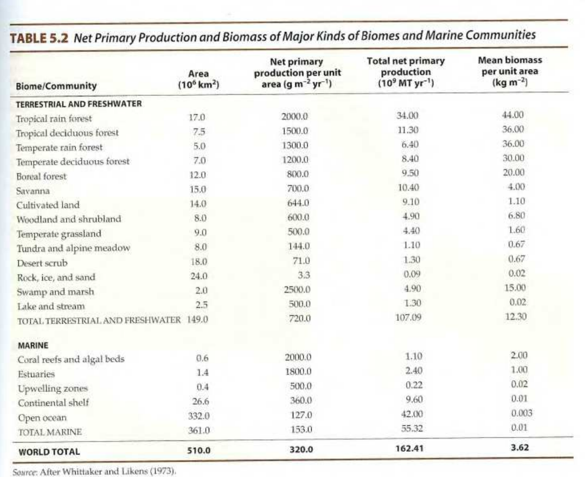


---

class: center, middle

# ¡Gracias!

## Preguntas adicionales: 
### jmartinez19@uasd.edu.do

### Material disponible en:
[https://biogegrafia-master.github.io/distribucion-dinamica-evolucion-biodiversidad/README.html](https://biogegrafia-master.github.io/distribucion-dinamica-evolucion-biodiversidad/README.html)

---

# Referencias

<div id="refs"></div>