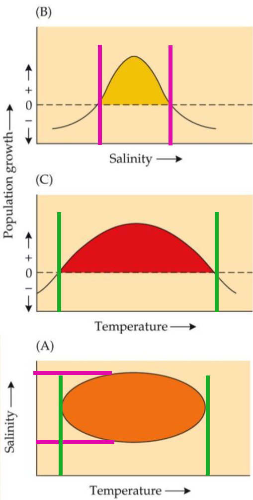

```{r setup, include=FALSE}
options(htmltools.dir.version = FALSE)
knitr::opts_chunk$set(
  echo = FALSE,
  warning = FALSE,
  message = FALSE,
  fig.retina = 3
)
library(knitr)
```

<style>
.title-slide {
  background-image: url('img/fondo.jpg');
  background-size: cover;
  background-position: center;
}
.remark-slide-content {
  font-size: 24px;
  line-height: 1.4;
  <!-- font-family: "Inter", "Helvetica Neue", Arial, sans-serif; -->
}
.large { font-size: 130% }
.medium { font-size: 110% }
.small { font-size: 90% }
.tiny { font-size: 70% }
.green { color: #2E8B57; }
.blue { color: #4169E1; }
.red { color: #DC143C; }
.yellow { color: #FFD700; }
.highlight { background-color: #ffff99; padding: 2px 4px; }
.box {
  background-color: #f0f8ff; border: 2px solid #4169E1; border-radius: 10px; padding: 20px; margin: 10px 0;
}
.box-small-margin {
  background-color: #f0f8ff; border: 2px solid #4169E1; border-radius: 10px; padding: 20px; margin: 2px 0;
}
.centered { text-align: center; }
blockquote { border-left: 4px solid #4169E1; padding-left: 12px; color: #333; }

.compact .remark-slide-content{
  /* menos relleno arriba/abajo de la slide */
  padding-top: 8px;
  padding-bottom: 8px;
}

/* Títulos más pegados al contenido */
.compact h1, .compact h2, .compact h3{
  margin-top: 0.15em;
  margin-bottom: 0.25em;
}

/* Párrafos y listas con menos interlínea y márgenes */
.compact p, .compact li{
  line-height: 1.15;
  margin: 0.15em 0 0.15em 0;
}

/* Columas .pull-* sin “respiro” extra */
.compact .pull-left, .compact .pull-right{
  margin-top: 0.1em;
}

/* Imágenes sin márgenes adicionales */
.compact img{
  margin: 0;
  padding: 0;
  display: block;
}

/* Cuando una imagen va dentro de un <li>, no metas aire extra */
.compact li > img{
  margin: 0.1em 0 0.25em 0;
}
</style>


---

class: center, middle, inverse

# Unidad 3
## Distribución, Dinámica y Evolución de la Biodiversidad

### Parte 1: Distribución de Especies

---

# Objetivos de Aprendizaje

Al finalizar esta unidad, el estudiante será capaz de:

- **Comprender** el concepto de ámbito geográfico como unidad fundamental de la biogeografía

- **Analizar** los factores que limitan la distribución de especies

- **Explicar** el concepto de nicho ecológico multidimensional de Hutchinson

- **Identificar** patrones derivados en la distribución de especies

- **Evaluar** métodos para predecir ámbitos geográficos

---

class: inverse, center, middle

# 1. Ámbito Geográfico: La Unidad Fundamental

---

# La Unidad Fundamental de la Biogeografía

.pull-left[
## El Ámbito Geográfico (Geographic Range)

- **Definición**: Área total ocupada por una especie
- **Importancia**: Base para entender todos los patrones biogeográficos
- **Características**:
  - Único para cada especie
  - Dinámico en el tiempo
  - Determinado por procesos ecológicos e históricos
]

.pull-right[
```{r, out.width="100%"}
# Pseudocódigo para visualización conceptual
knitr::include_graphics("https://cdn.britannica.com/86/189986-050-6742016F/Leopard-Panthera-pardus-geographic-range-Africa-Asia-2019.jpg")
```
*"La proposición de que cada especie tiene un ámbito geográfico único es central a toda la biogeografía"*
]

---

class: inverse, center, middle

```{r, out.width="100%"}
# Pseudocódigo para visualización conceptual
knitr::include_graphics("https://upload.wikimedia.org/wikipedia/commons/d/d2/Pinus_sylvestris_range.svg")
```
Ámbito [extensión] geográfico de *Pinus sylvestris*

---


# Distribución de Individuos

## Complejidad de la Distribución Real

.pull-left[
### Características Observadas:
- **Distribución agregada** (clumpy-gappy)
- **Dependiente de escala** espacial
- **Dinámica temporal** continua
- **Bordes difusos** y complejos
]

.pull-right[
### Factores que Influyen:
1. **Heterogeneidad ambiental**
2. **Capacidad de dispersión**
3. **Interacciones bióticas**
4. **Eventos estocásticos**
5. **Historia evolutiva**
]

---

.pull-left[
# El Problema de la Escala

## Abstracción Dependiente de Escala
- **Escala fina**: Distribución muy fragmentada
- **Escala gruesa**: Distribución aparentemente continua
- **Implicación**: Los bordes del ámbito son abstracciones dependientes de escala

]

.pull-right[
```{r, out.width="140%", fig.align="center"}

```
]

---

class: inverse, center, middle

# 2. Poblaciones en los Estudios de Distribución

---

## Tipos de Mapas de Distribución

.pull-left[
### 1. Mapas de Contorno (Outline)
- Área irregular sombreada
- Límites dibujados a mano
- Incluye estimaciones

### 2. Mapas de puntos (Dot)
- Localidades documentadas
- Registros de museo/observaciones
- Información precisa pero incompleta
]

.pull-right[
### 3. Mapas de isolíneas (Contour)
- Variación en abundancia
- Isolíneas de densidad
- Interpolación entre puntos

### 4. Mapas Combinados
- Puntos + ... + Isolíneas + ... + Rásters + otros
- Mayor información integrada
- Representación más completa
]

---

small: compact

.pull-left[
1. Mapas de Contorno (Outline)
```{r, out.width="140%", fig.align="center"}

```

2. Mapas de puntos (Dot)
```{r, out.width="140%", fig.align="center"}

```
]

.pull-right[
3. Mapas de isolíneas (Contour)
```{r, out.width="140%", fig.align="center"}

```

4. Mapas Combinados (e.g. rásters)
```{r, out.width="140%", fig.align="center"}

```
.small[
GARP: Genetic Algorithm for Rule-set Prediction.
]
]


---

# Dinámica Poblacional y Demografía

## Crecimiento Exponencial de Malthus (1798)

$$\frac{dN}{dt} = rN$$

Donde:
- **r** = tasa de crecimiento per cápita
- **r = b + i - d - e**
  - b = tasa de natalidad
  - i = tasa de inmigración  
  - d = tasa de mortalidad
  - e = tasa de emigración

---

class: compact

## Poblaciones Fuente y Sumidero

.pull-left[
### Poblaciones Fuente
- **b > d** (natalidad > mortalidad)
- **e > i** (emigración > inmigración)
- Producen individuos excedentes
- Mantienen poblaciones sumidero

### Poblaciones Sumidero
- **d > b** (mortalidad > natalidad)
- **i > e** (inmigración > emigración)
- Dependen de inmigración para persistir
- Comunes en bordes del ámbito
]

.pull-right[
```{r, out.width="100%"}
knitr::include_graphics("https://upload.wikimedia.org/wikipedia/commons/7/7f/Metapopulation.svg")
```
]

---

class: inverse, center, middle

# 3. Límites del Ámbito Geográfico

---

class: compact

# El Concepto de Nicho Multidimensional

## Hutchinson (1957)

.small[
.pull-left[
### Nicho como Hipervolumen
- **Espacio multidimensional**
- **Ejes** = variables ambientales
- **Volumen** = combinación de condiciones para supervivencia y reproducción

### Nicho Fundamental vs. Realizado (experimentos de Connell)
- **Fundamental**: Condiciones físicamente tolerables
- **Realizado**: Donde realmente ocurre (limitado por interacciones bióticas)
]
]
.pull-right[
```{r, out.width="45%"}

```
.tiny[
*Ejemplo: Nicho bidimensional de una especie acuática hipotética*
]
]

---

.pull-left[
```{r, out.width="100%"}

```
]

.pull-right[
```{r, out.width="100%"}

```
]

---

class: compact

## Factores Físicos Limitantes

### Principales Variables Abióticas

.pull-left[
1. **Temperatura**
- Límites térmicos críticos
- Interacción con otras variables
- Ejemplo: *Carnegiea gigantea*. OJO: cualquier IA te dirá que el *Pinus occidentalis* tiene límites térmicos críticos, pero no se ha medido.

2. **Química del Suelo/Agua**
- pH, salinidad, nutrientes
- Tolerancia osmorregulatoria
- Ejemplo: Great Salt Lake, lago Enriguillo, laguna de Oviedo, filtran fuertemente qué organismos prosperan
]

.pull-right[
3. **Disponibilidad de Agua**
- Estrés hídrico
- Adaptaciones xerofíticas vs. mesofíticas
- Trade-offs fisiológicos (especies xerofíticas invierten en ahorro de agua: cutículas gruesas, suculencia;  mesofíticas maximizan intercambio y crecimiento)
]

---

## Mensaje clave

- Los límites de distribución emergen de **umbrales fisiológicos + duración de la exposición** (temperatura/agua/química) y su **interacción con el ambiente local** (suelo, topografía, viento, etc.).

- En campo, hay que buscar **transiciones abruptas** (ecotonos) y **gradientes** (altitud, aridez, salinidad), pues ahí se "ven" los límites.

---

# Caso de Estudio: Saguaro (*Carnegiea gigantea*)

.pull-left[
## Limitación por Temperatura
- **Límite crítico**: -7°C
- **Sensibilidad**: Daño por heladas
- **Protección**: Árboles nodriza para juveniles
- **Correlación**: Límite norte = 12h continuas bajo 0°C
]

.pull-right[
```{r, out.width="100%"}
knitr::include_graphics("https://upload.wikimedia.org/wikipedia/commons/e/e2/Carnegiea_gigantea_range_map_3.png")
```

*Correspondencia entre distribución del saguaro y régimen de temperaturas invernales*
]

---
class: compact

# Interacciones con Otros Organismos

## Tipos de Interacciones Bióticas

.pull-left[
### 1. **Competencia**
- Intraespecífica e interespecífica
- Exclusión competitiva
- Ejemplo: Tamias (ardillas)

### 2. **Depredación**
- Incluyendo herbivoría y parasitismo
- Control biológico
- Ejemplo: Opuntia en Australia
]

.pull-right[
### 3. **Mutualismo**
- Polinización, dispersión
- Relaciones obligadas vs. facultativas
- Ejemplo: Acacia-Pseudomyrmex

### 4. **Interacciones Múltiples**
- Efectos indirectos
- Especies clave (keystone)
- Cascadas tróficas
]

---
class: compact

### Caso de Estudio: Competencia en Tamias. **Experimentos Naturales**

.pull-left[
**Patrón Normal**
- 2-3 especies por montaña
- Segregación por elevación
- Solapamiento mínimo

**Cuando Falta una Especie**
- Expansión del ámbito altitudinal
- Ocupación de todos los hábitats
- **Evidencia** de exclusión competitiva
- *Expansión de nicho cuando falta el competidor*
]

.pull-right[
```{r, out.width="80%"}
knitr::include_graphics("https://d9-wret.s3.us-west-2.amazonaws.com/assets/palladium/production/s3fs-public/styles/full_width/public/thumbnails/image/ChipmunkElevationMap_ChrisLowreyUSGS.jpg?itok=r5s0M6M9")
```
]
.tiny[
Distribución altitudinal de las ardillas listadas de Palmer (lim. inf. amarillo) y Panamint (lím. sup. rojo) en la cordillera Spring Range de Nevada.
]

---

class: inverse, center, middle

# 4. Patrones Derivados

---
class: compact

# Areografía: El Estudio de los Ámbitos

## Rapoport (1982) - Patrones Generales

.pull-left[
### 1. **Tamaño del Ámbito**
- Regla de Rapoport: ↑ latitud = ↑ tamaño de ámbito
- Variación entre taxones
- Excepciones y mecanismos

### 2. **Forma del Ámbito**
- Tendencia este-oeste en latitudes altas
- Distorsión por barreras geográficas
- Correlación con gradientes climáticos
]
.pull-right[
### 3. **Solapamiento de Ámbitos**
- ↓ latitud = ↑ solapamiento
- Hotspots de diversidad
- Patrones de endemismo
]

---

# Variación Interna del Ámbito

## Abundancia Poblacional

.pull-left[
### Patrones Observados:
1. **Autocorrelación espacial**
2. **Abundancia máxima** cerca del centro
3. **Abundancia baja** en los bordes
4. **Alta variabilidad** en el centro
5. **Excepción**: Bordes "duros" (costas)
]

.pull-right[
```{r, out.width="100%"}
knitr::include_graphics("https://via.placeholder.com/400x300/3F51B5/white?text=Gradiente+Abundancia%0ACentro+→+Periferia")
```

*Patrón típico: abundancia alta y variable en el centro, baja en la periferia*
]

---

# Ecogeografía: Variación Fenotípica

## "Reglas" Ecogeográficas Clásicas

### 1. **Regla de Bergmann**
- ↑ latitud = ↑ tamaño corporal
- Termorregulación (relación superficie/volumen)

### 2. **Regla de Allen**
- ↑ latitud = ↓ tamaño de apéndices
- Conservación de calor

### 3. **Regla de Jordan**
- ↑ latitud = ↑ número de vértebras
- Peces: adaptación a temperatura

---

# Predicción de Ámbitos Fundamentales y Realizados

## Modelado de Distribución de Especies (SDM)

### Procedimiento General:

1. **Datos de ocurrencia** + variables ambientales
2. **Análisis estadístico** de afinidades ambientales  
3. **Modelado espacial** del ámbito fundamental
4. **Incorporación** de factores históricos/bióticos
5. **Validación** con datos independientes
6. **Refinamiento** iterativo
7. **Predicción** bajo escenarios futuros

---

# Aplicaciones del Modelado SDM

.pull-left[
## Conservación
- Identificación de hábitat crítico
- Planificación de reservas
- Evaluación de riesgo de extinción

## Cambio Climático
- Predicción de shifts de ámbito
- Identificación de refugios
- Planificación de corredores
]

.pull-right[
## Especies Invasoras
- Evaluación de riesgo de invasión
- Predicción de expansión
- Estrategias de control temprano

## Agricultura
- Predicción de plagas
- Zonificación de cultivos
- Manejo integrado
]

---

class: inverse, center, middle

# 5. Síntesis y Conceptos Clave

---

# Síntesis: Factores Limitantes

## Patrón General Emergente

### **Hipótesis Abiotic-Biotic**
- **Latitudes altas**: Limitación por estrés abiótico
- **Latitudes bajas**: Limitación por interacciones bióticas

### **Gradientes Locales**
- **Ambientes estresantes**: Dominan factores físicos
- **Ambientes benignos**: Dominan interacciones biológicas

### **Implicaciones**
- Predicción de respuestas al cambio climático
- Estrategias de conservación diferenciadas
- Comprensión de gradientes de diversidad

---

# Conceptos Clave para Recordar

.pull-left[
## Fundamentales
1. **Ámbito geográfico** = unidad básica
2. **Nicho multidimensional** de Hutchinson
3. **Fundamental vs. Realizado**
4. **Poblaciones fuente-sumidero**
5. **Dependencia de escala**
]

.pull-right[
## Aplicados
1. **Modelado de distribución**
2. **Patrones areográficos**
3. **Reglas ecogeográficas**
4. **Limitación abiotic-biotic**
5. **Predicción de cambios**
]

---

# Conexiones con Otras Áreas

.pull-left[
## Ecología (Smith & Smith)
- **Poblaciones**: Crecimiento, regulación, metapoblaciones
- **Comunidades**: Interacciones especies, estructura trófica
- **Ecosistemas**: Flujos de energía, ciclos biogeoquímicos

## Evolución
- **Especiación alopátrica**: Aislamiento geográfico (vicariante o dispersión)
- **Especiación simpátrica**: Sin aislamiento (divergencia en nichos ecológicos o poliploidía)
- **Selección natural**: Adaptación local
- **Deriva genética**: Poblaciones pequeñas en bordes
]

.pull-right[
## Conservación
- **Diseño de reservas**: Ámbitos críticos
- **Fragmentación**: Poblaciones fuente-sumidero
- **Cambio global**: Modelado predictivo
]

---

class: center, middle

# Preguntas y Discusión

## ¿Qué factores creen que serán más importantes para limitar distribuciones en el contexto del cambio climático?

## ¿Cómo podemos usar el modelado de distribución para conservación en su región?

---

class: center, middle, inverse

# Próxima Clase

## Distribución de Comunidades
### Definiciones, organización, patrones espacio-temporales

### Preparar: 
- Lectura sobre biomas y comunidades
- Ejemplos locales de tipos de vegetación

---

class: center, middle

# ¡Gracias!

## Preguntas adicionales: 
### jmartinez19@uasd.edu.do

### Material disponible en:
[https://biogegrafia-master.github.io/distribucion-dinamica-evolucion-biodiversidad/README.html](https://biogegrafia-master.github.io/distribucion-dinamica-evolucion-biodiversidad/README.html)